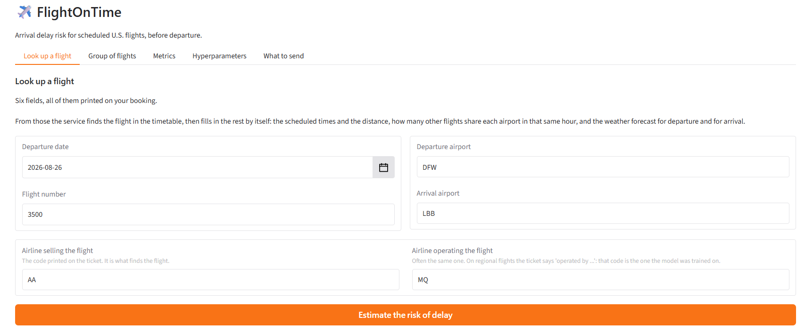

# FlightOnTime

<a target="_blank" href="https://cookiecutter-data-science.drivendata.org/"></a>
[](https://www.python.org/)
[](https://huggingface.co/spaces/beviale/FlightOnTime)
[](https://dagshub.com/Beviale/FlightOnTime)

[](https://github.com/Beviale/FlightOnTime/actions/workflows/ruff.yml)
[](https://github.com/Beviale/FlightOnTime/actions/workflows/pynblint.yml)
[](https://github.com/Beviale/FlightOnTime/actions/workflows/tests.yml)
[](https://github.com/Beviale/FlightOnTime/actions/workflows/deploy.yml)

## Table of Contents

1. [Project Summary](#project-summary)
2. [Quick Start Guide](#quick-start-guide)
3. [Project Organization](#project-organization)
4. [Architecture](#architecture)
5. [Experiments](#experiments)
6. [Milestones Description](#milestones-description)
   - [Milestone 1 - Inception](#milestone-1---inception)
   - [Milestone 2 - Reproducibility](#milestone-2---reproducibility)
   - [Milestone 3 - Quality Assurance](#milestone-3---quality-assurance)
   - [Milestone 4 - API Integration](#milestone-4---api-integration)
   - [Milestone 5 - Deployment](#milestone-5---deployment)
   - [Milestone 6 - Monitoring](#milestone-6---monitoring)

## Project Summary

FlightOnTime estimates the risk that a scheduled US domestic flight arrives at least
fifteen minutes late, and it does so **before the flight departs**. The target is the
BTS `ArrDel15` flag; the model sees only what is knowable in advance - the timetable,
the airline, the airports, how busy those airports are in that hour, where the
aircraft is in its day, and the weather forecast for departure and arrival.

That constraint is the whole difficulty of the problem. The strongest predictors of a
delay - whether the inbound aircraft is already running late, what the weather turned
out to be - are unavailable at the moment the answer is needed. What the service
offers instead is a calibrated probability: when it says 30%, roughly thirty flights
in a hundred like it do arrive late.

Two models are served rather than one. The weather forecast can fail - the flight is beyond
the five-day horizon, or the weather service (Open-Meteo) is unreachable - and rather than refuse
an answer, the service falls back to a variant trained without weather at all. Every
response names which model produced it, so a degraded answer is never mistaken for a
complete one.

The system is deployed on a public [Hugging Face Space](https://huggingface.co/spaces/beviale/FlightOnTime)
with a Gradio interface, and can be run in full locally alongside Prometheus, Grafana
and Locust.



Six fields, all of them printed on a boarding pass. From those the service finds the
flight in the timetable and fills in the rest by itself: the scheduled times and the
distance, how many other flights share each airport in that hour, and the weather
forecast for departure and for arrival.

Those six fields are the **auto-lookup path**: the caller names a flight and the service
recovers everything else. It is the shorter way in, and the one that depends on an
outside schedule service being reachable (AeroDataBox).
The **manual entry path** is the other. There the caller supplies every column the models
read — the scheduled times, the distance, the congestion counts, where the aircraft is in
its day... — and the service adds only the weather, which is the one thing it alone can look
up.

## Quick Start Guide

### Prerequisites

- **Python 3.12**
- **uv** — package manager ([install](https://docs.astral.sh/uv/getting-started/installation/))
- **DVC** — data version control ([install](https://dvc.org/))
- **Docker** ([install](https://www.docker.com/))

### 1. Clone the repository

```bash
git clone https://github.com/Beviale/FlightOnTime.git
cd FlightOnTime
```

### 2. Environment variables

Create a `.env` file in the project root:

```bash
DAGSHUB_USER_TOKEN=<your_dagshub_token>   # model registry, and DVC remote
RAPIDAPI_KEY=<your_rapidapi_key>          # AeroDataBox, for the auto-lookup path
MODEL_RELOAD_TOKEN=<any_secret_you_pick>  # optional, guards POST /model/reload
```

Only the first is needed to serve predictions. Without `RAPIDAPI_KEY` the manual-entry
path still works; only the auto-lookup by flight number stops.

### 3. Fetch the data

```bash
uv sync
uv run dvc pull
```

`dvc pull` retrieves several gigabytes. To serve the API you only need the two airport
reference tables:

```bash
uv run dvc pull data/external/airports.csv data/external/airport_identity.csv
```

### 4. Run it

**The service alone:**

```bash
uv run uvicorn predicting_flight_arrival_delays.app.main:app --port 7860
```

**The full stack**, with monitoring and load testing:

```bash
docker compose up --build
```

| Service | URL | Description |
|---------|-----|-------------|
| **FlightOnTime** | http://localhost:7860 | API and Gradio interface |
| **Prometheus** | http://localhost:9090 | Metrics collection |
| **Grafana** | http://localhost:4444 | Dashboard |
| **Locust** | http://localhost:8089 | Load testing |

Stop it with `docker compose down`.

> **Working on the code?** The [Developer Guide](docs/Developer_Guide.md) covers the
> pipeline, how to add a model or a feature, and the traps worth knowing before you hit
> them.

### 5. Reproduce the pipeline

```bash
uv run dvc repro
```

## Project Organization

```
├── Dockerfile                                     <- Serving image, also what Hugging Face builds
├── docker-compose.yml                             <- Local stack: app, Prometheus, Grafana, Locust
├── prometheus.yml                                 <- Scrape configuration
├── dvc.yaml / dvc.lock                            <- Pipeline definition and lock
├── pyproject.toml / uv.lock                       <- Dependencies, ruff and pytest configuration
├── Makefile                                       <- Convenience commands
│
├── .github/workflows/
│   ├── ruff.yml                                   <- Lint, autofix, and push the fixes back
│   ├── tests.yml                                  <- Unit tests, data suites, behavioural tests
│   ├── pynblint.yml                               <- Notebook linting
│   └── deploy.yml                                 <- Build the deploy branch, push to the Space
│
├── data/
│   ├── raw/                                       <- BTS monthly extracts, immutable
│   ├── external/                                  <- Airport tables, weather archive
│   ├── interim/                                   <- Preprocessed flights, drift reference
│   └── processed/selection/                       <- Walk-forward folds, per variant
│
├── docs/
│   ├── FlightOnTime_ML_Canvas.md                  <- ML canvas
│   ├── Developer_Guide.md                         <- Setup, pipeline, and how to extend it
│   ├── Dataset_Card.md                            <- Sources, target, splits, known defects
│   ├── Model_Card.md                              <- The registered models, and how to read them
│   └── Risk_Classification.md                     <- Risk classification under the AI Act
│
├── grafana/
│   ├── dashboards/flightontime.json               <- The dashboard, provisioned from disk
│   └── provisioning/                              <- Datasource and dashboard providers
│
├── locust/
│   ├── locustfile.py                              <- Load profile
│   └── Dockerfile                                 <- Isolated Locust image
│
├── metrics/
│   ├── selection/<variant>/                       <- Every candidate's walk-forward metrics
│   └── winner/<variant>/                          <- The registered model's test metrics
│
├── reports/
│   ├── drift/                                     <- Deepchecks drift reports
│   ├── great_expectations/                        <- Data validation reports
│   ├── pytest/                                    <- HTML test report
│   ├── locust/                                    <- Load test reports
│   └── figures/                                   <- Generated figures
│
├── scripts/
│   └── drift_report.py                            <- Deepchecks runner, own pinned environment
│
├── notebooks/                                     <- Exploratory analysis
│
├── predicting_flight_arrival_delays/
│   ├── config.py                                  <- Every path, column list and threshold
│   ├── utils.py                                   <- MLflow registry: register and load bundles
│   │
│   ├── data/
│   │   ├── dataset.py                             <- Download the BTS extracts
│   │   ├── build_airports.py                      <- Airport coordinates and time zones
│   │   ├── build_airport_identity.py              <- IATA code to airport id, with history
│   │   ├── weather.py                             <- Fetch the forecast archive
│   │   ├── preprocess.py                          <- Cleaning and feature engineering
│   │   ├── features.py                            <- Variant feature sets
│   │   ├── transform.py                           <- Encoding, delay rates, feature selection
│   │   ├── split_data.py                          <- Walk-forward splits
│   │   └── drift_reference.py                     <- The sample production is compared against
│   │
│   ├── modeling/
│   │   ├── hyperparams.yaml                       <- Candidate configurations
│   │   ├── train.py                               <- Fit and calibrate
│   │   ├── train_evaluate_save_metrics.py         <- One candidate over every fold
│   │   ├── evaluate.py                            <- Metrics
│   │   ├── predict.py                             <- Inference-time preparation
│   │   ├── explainability.py                      <- SHAP and the closed-form linear path
│   │   └── select_and_register.py                 <- Pick the winner, register it
│   │
│   └── app/
│       ├── main.py                                <- FastAPI application and lifespan
│       ├── schema.py                              <- Request and response models
│       ├── inputs.py                              <- Which columns a model needs
│       ├── inference.py                           <- Route each flight to a variant
│       ├── monitoring.py                          <- Prometheus metrics
│       ├── drift.py                               <- Log what was scored
│       ├── drift_scheduler.py                     <- The nightly comparison
│       ├── ui.py / wrapper.py                     <- Gradio interface
│       ├── routers/                               <- prediction.py, model_info.py
│       └── enrichment/                            <- Everything the caller does not send
│           ├── reference.py                       <- Airport coordinates
│           ├── identity.py                        <- Resolve a code to an airport
│           ├── weather_live.py                    <- Open-Meteo forecast
│           ├── aerodatabox.py                     <- Schedules and congestion
│           ├── lookup.py                          <- Build a flight from its number
│           └── builder.py                         <- Assemble the feature frame
│
└── tests/
    ├── test_flight_data/                          <- Great Expectations on raw and processed data
    ├── test_behavioral_model/                     <- Directional, invariance, minimum functionality
    └── test_predicting_flight_arrival_delays/     <- Unit tests
```

## Architecture

### The DVC pipeline

Ten stages, one of them expanded by `foreach` into 24 parallel instances.

1. **download_bts** — fetch the monthly On-Time Performance extracts.
2. **build_airports** — coordinates and time zone for every airport, from T_MASTER_CORD.
3. **prepare_flights** — clean, derive the target, and build the schedule features.
4. **build_airport_identity** — map each IATA code to the airport ids that have used it,
   keeping the most recent naming when a code was reassigned.
5. **download_weather** — hourly forecast archive for every airport and date, at the lead
   time a passenger would have had.
6. **join_weather** — attach the forecast to each flight, at departure and at arrival.
7. **build_drift_reference** — a fixed 50,000-flight sample of the training distribution.
8. **split_data_cv** — walk-forward folds: train, validation and test contiguous in time,
   with no gaps and no shuffling.
9. **train_evaluate_save_metrics** — every candidate over every fold. `foreach` over three
   variants and eight configurations.
10. **select_and_register** — pick the winner per variant, calibrate, choose the operating
    threshold, register it in MLflow.

**Why walk-forward and not a random split.** Delay patterns move with the season and with
the airline's schedule. A random split lets the model learn from August to predict March,
which no deployed model can do. Every fold trains on the past and is measured on the
future.

### Serving

A request names a flight; the service fills in the rest. Airport coordinates come from a
local table, the schedule and congestion counts from AeroDataBox, the forecast from
Open-Meteo. Whether the forecast resolved decides which model answers, and the answer
says so.

## Experiments

All runs are tracked in MLflow on [DagsHub](https://dagshub.com/Beviale/FlightOnTime.mlflow).

### Setup

Three algorithms — **LightGBM**, **Random Forest**, **Logistic Regression** — over three
feature variants:

| Variant | Feature set | Purpose |
|---------|-------------|---------|
| **all** | everything, weather included | the model served when the forecast resolves |
| **noweather** | weather columns removed | the fallback, and a measure of what weather is worth |
| **nocarrier** | carrier delay rates removed | an ablation, not deployed |

Metrics are averaged over the walk-forward folds. LightGBM uses native categorical
handling; the linear and forest models use one-hot encoding. Every registered model is
wrapped in isotonic calibration fitted on a held-out validation set.

### Results — validation, by variant

The winner of each variant, in bold, is the configuration with the best validation PR-AUC.

| Model | ROC-AUC | PR-AUC | Brier | ROC-AUC std |
|-------|---------|--------|-------|-------------|
| **all — LightGBM (deep)** | **0.7199** | **0.4744** | 0.1597 | 0.0020 |
| all — LightGBM (default) | 0.7198 | 0.4735 | 0.1595 | 0.0023 |
| all — LightGBM (regularised) | 0.7196 | 0.4734 | 0.1597 | 0.0018 |
| all — LightGBM (fast) | 0.7186 | 0.4717 | 0.1596 | 0.0035 |
| all — Random Forest (default) | 0.7028 | 0.4658 | 0.1585 | 0.0019 |
| all — Logistic Regression (weak_l2) | 0.6802 | 0.3805 | 0.1687 | 0.0103 |
| all — Logistic Regression (default) | 0.6802 | 0.3805 | 0.1686 | 0.0103 |
| all — Logistic Regression (strong_l2) | 0.6801 | 0.3804 | 0.1687 | 0.0103 |
| **noweather — LightGBM (default)** | **0.7046** | **0.4526** | 0.1619 | 0.0137 |
| noweather — LightGBM (deep) | 0.7041 | 0.4519 | 0.1621 | 0.0119 |
| noweather — LightGBM (regularised) | 0.7040 | 0.4512 | 0.1620 | 0.0151 |
| noweather — LightGBM (fast) | 0.7040 | 0.4509 | 0.1617 | 0.0142 |
| noweather — Random Forest (default) | 0.6948 | 0.4409 | 0.1992 | 0.0100 |
| noweather — Logistic Regression (strong_l2) | 0.6692 | 0.3596 | 0.1690 | 0.0192 |
| noweather — Logistic Regression (default) | 0.6692 | 0.3596 | 0.1690 | 0.0191 |
| noweather — Logistic Regression (weak_l2) | 0.6692 | 0.3596 | 0.1690 | 0.0191 |
| **nocarrier — LightGBM (default)** | **0.7160** | **0.4686** | 0.1604 | 0.0023 |
| nocarrier — LightGBM (deep) | 0.7154 | 0.4684 | 0.1604 | 0.0015 |
| nocarrier — LightGBM (regularised) | 0.7154 | 0.4682 | 0.1604 | 0.0022 |
| nocarrier — LightGBM (fast) | 0.7159 | 0.4680 | 0.1603 | 0.0035 |
| nocarrier — Random Forest (default) | 0.7087 | 0.4580 | 0.1708 | 0.0035 |
| nocarrier — Logistic Regression (default) | 0.6710 | 0.3704 | 0.1697 | 0.0112 |
| nocarrier — Logistic Regression (weak_l2) | 0.6710 | 0.3704 | 0.1697 | 0.0113 |
| nocarrier — Logistic Regression (strong_l2) | 0.6710 | 0.3703 | 0.1697 | 0.0113 |

**What the comparison shows.** Weather is worth about 1.5 points of ROC-AUC — the whole
gap between `all` and `noweather`. The carrier delay rates are worth about 0.4. Gradient
boosting beats the linear model by roughly 4 points, which is the non-linearity in the
problem: a delay depends on the *combination* of airport, hour and weather, not on their
sum.

### Registered models

`all` selected **LightGBM (deep)**, `noweather` **LightGBM (default)**. Measured on the
held-out test
folds, at the operating threshold each was released with:

| Variant | ROC-AUC | PR-AUC | Brier | Recall | Precision | Threshold | Alert rate |
|---------|---------|--------|-------|--------|-----------|-----------|------------|
| **all** | 0.7074 | 0.4433 | 0.1555 | 0.610 | 0.358 | 0.240 | 38.4% |
| **noweather** | 0.6910 | 0.4241 | 0.1599 | 0.651 | 0.332 | 0.234 | 45.0% |


## Milestones Description

### Milestone 1 - Inception

The project was scaffolded from the **CCDS template**. A **Machine Learning Canvas** was
written to fix the objective, the data, the metrics and the decision the model supports
before any code was committed: [docs/FlightOnTime_ML_Canvas.md](docs/FlightOnTime_ML_Canvas.md).

### Milestone 2 - Reproducibility

**DVC** was initialised and the full pipeline defined, from download to registration. Every
dependency is declared, so a change to one file re-runs exactly the stages that depend on
it and no others. The training stage uses `foreach` to expand across variants and
configurations.

**MLflow on DagsHub** tracks every run — parameters, metrics, the dataset hash and whether
the working tree was dirty. Models that beat a random-guess baseline are registered with
their transformer and column order, so a registered version is self-contained: everything
needed to prepare data for it is recoverable from the registry alone.

### Milestone 3 - Quality Assurance

**Static linting.** *Ruff* over the package, the tests and the scripts; *Pynblint* over the
notebooks. Both run in GitHub Actions.

**Data quality.** *Great Expectations* suites on the raw extracts and on the preprocessed
frame. The raw suite is parametrised over every monthly file rather than a single one — it
is a contract with the data supplier, and a schema they change appears in the newest
delivery, not the oldest. It has already caught real defects: three months carry a flight
with a negative or day-long scheduled block time, which the pipeline now drops.

Reports are written to [reports/great_expectations](reports/great_expectations).

**Tests.** Unit tests across the data, modeling and serving modules; **behavioural tests**
against the registered champions, covering directional expectations (worse weather must not
lower the risk), invariance (a flight scores the same alone as in a batch), and minimum
functionality. The PDF report lands in [reports/pytest](reports/pytest).

**Explainability.** SHAP `TreeExplainer` for the tree models and the closed form
`coef · (x − E[x])` for logistic regression, verified to agree with `shap.LinearExplainer`.
Contributions are folded back from encoded columns onto the columns a caller actually
sends, so an explanation speaks the requester's vocabulary rather than the matrix's.

**Risk classification** under the AI Act: [docs/Risk_Classification.md](docs/Risk_Classification.md).

**Cards.** A [dataset card](docs/Dataset_Card.md) documenting the sources, the target, the
splits and the defects found in the raw extracts; and a [model card](docs/Model_Card.md)
for the two registered champions — what they are for and what they are not for.

### Milestone 4 - API Integration

A FastAPI service, with Gradio mounted at the root.

#### Prediction router

- **POST /predictions** — score one flight. `?explain=true` adds contributions and a
  waterfall.
- **POST /batch-predictions** — score many, each routed to the variant its weather allows.
- **POST /predictions/lookup** — score a flight the caller only named: date, carrier,
  number, origin, destination. The service resolves the rest from the live schedule.
- **POST /explanations** — score one flight and say what moved the answer.

#### Model info router

- **GET /model/hyperparameters** — what each served model was trained with.
- **GET /model/metrics** — the metrics it was released on.
- **GET /model/inputs** — which columns a caller must send, and which are optional.
- **POST /model/reload** — put a newly registered version into service without a restart.
  Guarded by `MODEL_RELOAD_TOKEN`.

#### General

- **GET /** — the Gradio interface.
- **GET /status** — which variants are answering, and from which run.
- **GET /metrics** — Prometheus exposition.

### Milestone 5 - Deployment

**User interface.** A Gradio application with two paths: auto-lookup from a flight number,
and manual entry for a flight the schedule service does not know. The explanation is shown
as a waterfall chart — base value, the leading contributions, the summed rest, and the
calibration step — so the bars add up to the probability given.

**Containerisation.** A `Dockerfile` and a `.dockerignore` that ships the package and the two
airport tables and nothing else. Notably it also installs `libgomp1`: LightGBM's OpenMP
runtime is a system library no Python package carries.

**Continuous integration.**

| Workflow | Trigger | Purpose |
|----------|---------|---------|
| `ruff.yml` | pull request | lint, autofix, push the corrections back to the branch |
| `pynblint.yml` | PR touching `notebooks/**` | notebook linting |
| `tests.yml` | pull request | unit tests, data suites, behavioural tests |
| `deploy.yml` | push to `main` | sync → deploy to the Space |

**Continuous deployment.** A merge to `main` builds a `deploy` branch containing only what
the service needs, pushes it to the Space, and then polls the Hugging Face API until the
Space reports `RUNNING` — so the workflow reports whether the deployment *started*, not
merely whether it was sent.

### Milestone 6 - Monitoring

#### Infrastructure

A `docker-compose.yml` stack: the application, **Prometheus** scraping it every five
seconds, **Grafana** with a provisioned dashboard, and **Locust** for load.

#### Resource monitoring

Generic HTTP metrics come from `prometheus-fastapi-instrumentator`. On top of them sit the
counters this service in particular needs:

| Metric | Answers |
|--------|---------|
| `flights_scored_total{variant,weather}` | which model answered, and why |
| `delay_probability` | the shape of what the model predicts |
| `outcomes_total{outcome}` | how the calls fell either side of the threshold |
| `approximated_flights_total` | how often callers omit a column the model leans on |
| `scoring_seconds{endpoint}` | scoring cost, without the HTTP overhead |
| `errors_total{endpoint,reason}` | refusals, by cause |

The first of these is the one that earns its place. When the forecast fails, the service
answers **200, quickly**, using the fallback model — from the HTTP layer that looks like
perfect health. The `variant` label is the only thing that shows the enrichment path
breaking.

#### Performance monitoring

Every scored flight is appended to a production log, and a nightly **APScheduler** job
compares a rolling window of it against the training reference using **Deepchecks**
`FeatureDrift`. Reports land in [reports/drift](reports/drift).

Two design points are worth naming.

The comparison takes a **window** — seven days by default — rather than the whole log.
Measured on a file of 30,000 old rows and 2,000 fresh ones, the same anomaly scored 0.924
over a week and 0.059 over the whole file: an append-only log dilutes a recent shift into
invisibility, which is the opposite of what a monitor is for.

The comparison runs **out of process**. Deepchecks pins scikit-learn below 1.6 and numpy
below 2, while this project trains on 1.9 and 2.5. Rather than drag the modelling stack
backwards, `scripts/drift_report.py` declares its own environment in a PEP 723 header and
the scheduler shells out to it — which also means a comparison that hangs is killed at a
deadline without touching the service.

Drift on the features is the only signal available in real time: the true label arrives
weeks after the flight lands, so the distribution of what the model *predicts* is the
earliest warning there is.
